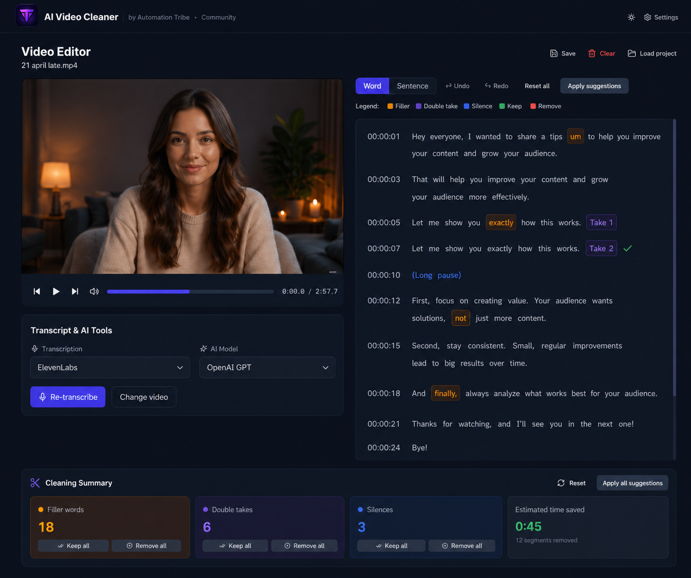

# Tribe Video Cleaner

**Automatically remove filler words, double takes, and long silences from your videos — without touching a timeline.**

Built by [Automation Tribe](https://automation-tribe.com) · [Join the Community on Skool](https://www.skool.com/automation-tribe)

---

## What's included

- **Upload any video** — MP4, MOV, AVI, WebM, MKV up to 500 MB
- **Word-level transcription** — powered by ElevenLabs Scribe or OpenAI Whisper
- **AI analysis** — OpenAI GPT or Anthropic Claude to detect what to cut
- **Local detection** (no API key required for basic use) — filler words, silences, and double takes found automatically
- **Interactive transcript editor** — click any word to move the video playhead; right-click for bulk actions
- **Live preview** — playback automatically skips removed segments so you can hear the result before exporting
- **Undo / Redo** with full history
- **FFmpeg rendering** — server-side, high quality output
- **SRT subtitle export** — with optional burn-in
- **Light and dark theme** — toggle in the top nav bar
- **Settings saved locally** in your browser — no account needed



---

## Before you start

### Step 1 — Install Node.js

Node.js is the only thing you need to install manually. Everything else (including FFmpeg) is installed automatically by `npm install`.

👉 Download Node.js: **[nodejs.org](https://nodejs.org)** — choose the **LTS** version (the green button).

To check if you already have it, open a terminal and run:

```bash
node --version
```

You need version **18 or newer**. If you see something like `v20.x.x` you're good to go.

> **Windows users:** during the Node.js installer, make sure to check the box that says **"Add to PATH"** so you can run `node` and `npm` from any terminal window.

---

### Step 2 — Install Git

Git is needed to clone (download) the project to your computer.

👉 Download Git: **[git-scm.com](https://git-scm.com)**

To check if you already have it:

```bash
git --version
```

> **Mac users:** if you have Xcode Command Line Tools installed, Git is already there.

---

### Step 3 — Get at least one API key

You need at least one transcription key to use the app. Analysis is optional.

| Service | Used for | Where to get it |
|---|---|---|
| **ElevenLabs** | Transcription — best word-level accuracy | [elevenlabs.io](https://elevenlabs.io) |
| **OpenAI** | Whisper transcription + GPT analysis | [platform.openai.com](https://platform.openai.com) |
| **Anthropic** | Claude analysis | [console.anthropic.com](https://console.anthropic.com) |

You can enter keys directly in the **Settings page** inside the app — no config file needed. They are stored only in your browser and never shared.

> **FFmpeg** is bundled inside the project automatically — you do **not** need to install it separately.

---

## Installation

### 1 — Clone the repository

Open a terminal, navigate to the folder where you want to save the project, then run:

```bash
git clone https://github.com/grafup/Tribe-Video-Cleaner.git
cd Tribe-Video-Cleaner
```

### 2 — Install all dependencies

```bash
npm install
```

This installs everything — Next.js, all UI libraries, and FFmpeg. It may take a minute or two the first time.

### 3 — Add your API keys (two ways)

**Option A — inside the app (easiest):**
Start the app and go to the **Settings** page. Paste your keys there. Done.

**Option B — via environment file:**

```bash
cp .env.local.example .env.local
```

Open `.env.local` in any text editor and fill in your keys:

```env
ELEVENLABS_API_KEY=your_key_here
OPENAI_API_KEY=your_key_here
ANTHROPIC_API_KEY=your_key_here
```

> Environment variables take priority over keys entered in the Settings page.

### 4 — Start the app

```bash
npm run dev
```

Open **[http://localhost:4000](http://localhost:4000)** in your browser.

---

## Open with your editor

### VS Code

```bash
code .
```

Install the recommended extensions when prompted (ESLint, Tailwind CSS IntelliSense).

### Cursor

```bash
cursor .
```

Cursor has built-in AI assistance — you can open any file and ask it to explain or modify the code directly in the editor.

---

## Use with AI coding assistants

### Claude Code (Anthropic)

[Claude Code](https://claude.ai/code) is an AI agent that can read, write, and run your entire project from the terminal.

```bash
# Install globally
npm install -g @anthropic-ai/claude-code

# Launch inside the project folder
cd Tribe-Video-Cleaner
claude
```

Then describe in plain English what you want to change — Claude Code will find the right files and make the edits.

### OpenAI Codex / ChatGPT

Open [ChatGPT](https://chatgpt.com) with code interpreter or use [GitHub Copilot](https://github.com/features/copilot) in your editor. The project is standard Next.js + TypeScript, so any AI assistant can read and modify it.

---

## Project structure

```
src/
├── app/
│   ├── page.tsx                   # Main editor page
│   ├── settings/page.tsx          # Settings page
│   └── api/
│       ├── upload/                # Video upload handler
│       ├── extract-audio/         # FFmpeg audio extraction
│       ├── transcribe/            # ElevenLabs / Whisper transcription
│       ├── analyze/               # GPT / Claude transcript analysis
│       ├── render/                # FFmpeg video rendering
│       ├── progress/[jobId]/      # SSE render progress stream
│       └── files/[filename]/      # Serve uploaded and rendered files
├── components/
│   ├── editor/                    # VideoPreview, TranscriptEditor, TimelinePanel, RenderPanel
│   ├── settings/                  # ApiKeys, FillerWords, Silence, Subtitle, Output settings
│   └── ui/                        # Button, Input, Select, Slider, Toggle, Toast, Modal
├── store/
│   ├── editor.ts                  # Editor state + undo/redo (Zustand)
│   ├── settings.ts                # Persisted app settings (Zustand + localStorage)
│   └── theme.ts                   # Light/dark theme preference
└── lib/
    ├── detection.ts               # Filler word, silence, double-take detection algorithms
    ├── subtitles.ts               # SRT / VTT generation
    └── utils.ts                   # Shared helpers and segment color mapping
```

---

## Tech stack

| Layer | Technology |
|---|---|
| Framework | Next.js 14 (App Router) |
| Language | TypeScript |
| Styling | Tailwind CSS (dark + light theme) |
| State | Zustand with immer + localStorage persist |
| Video processing | fluent-ffmpeg (server-side) |
| Transcription | ElevenLabs SDK, OpenAI SDK |
| AI analysis | OpenAI SDK, Anthropic SDK |
| UI components | Radix UI primitives |

---

## Deploying to production

### Vercel (easiest)

```bash
npm install -g vercel
vercel
```

Add your API keys as environment variables in the Vercel dashboard under **Settings → Environment Variables**. For large video files, use a self-hosted option below — Vercel functions time out after 60 seconds by default.

### Self-hosted (Railway, Fly.io, or any VPS)

For long render times and large uploads, a persistent server is recommended. Set the three environment variables and run:

```bash
npm run build
npm start
```

---

## Support

Got questions, ran into an issue, or want to show what you built?

**Community support is available on Skool:**

👉 **[skool.com/automation-tribe](https://www.skool.com/automation-tribe)**

Post in the community and the Automation Tribe team will help you get set up.

---

## Links

- 🌐 Website: [automation-tribe.com](https://automation-tribe.com)
- 👥 Community: [skool.com/automation-tribe](https://www.skool.com/automation-tribe)
- 🐛 Issues: [github.com/grafup/Tribe-Video-Cleaner/issues](https://github.com/grafup/Tribe-Video-Cleaner/issues)

---

*Made with ❤️ by [Automation Tribe](https://automation-tribe.com)*
